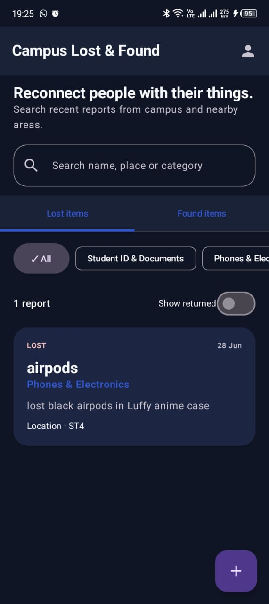
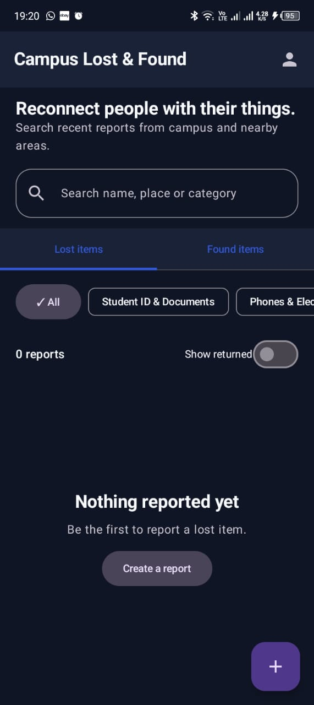
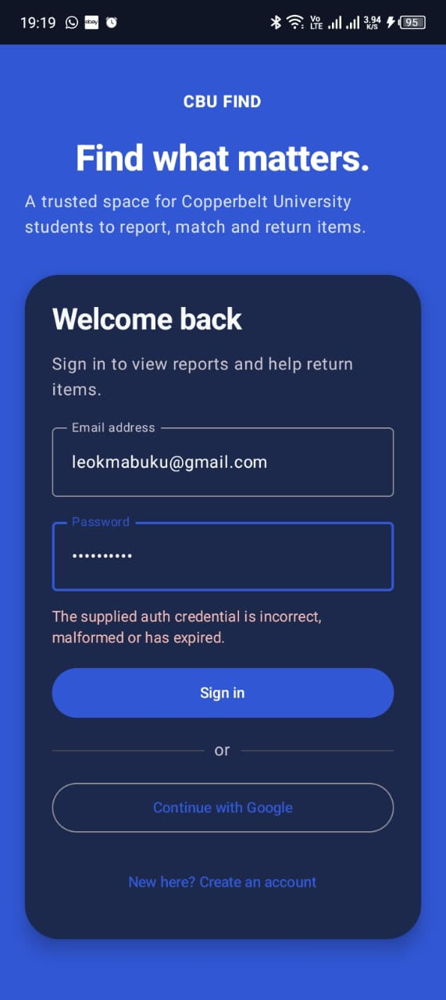

# CBU Find — Campus Lost and Found

CBU Find is a native Android application that helps Copperbelt University students report, discover, and return lost property. It combines a focused Jetpack Compose interface with Firebase authentication and live Firestore data.

## Features

- Email/password and Google authentication
- Student profiles with programme, year, and contact details
- Lost and found reports with categories, locations, photos, and validation
- Live report feeds, text search, category filters, and resolved-item filtering
- Report ownership and returned/resolved status tracking
- Cloudinary uploads for profile and report images
- Light and dark Material 3 themes

## Screenshots

| Report feed | Empty state | Sign-in feedback |
| --- | --- | --- |
|  |  |  |

## Tech stack

- Kotlin and Jetpack Compose
- Material 3 and Navigation Compose
- Firebase Authentication and Cloud Firestore
- Cloudinary unsigned image uploads
- Coil for image loading
- Gradle Kotlin DSL

## Requirements

- Android Studio with JDK 17
- Android SDK 34
- A Firebase project with an Android app registered as `com.campus.lostandfound`
- A Cloudinary account and unsigned upload preset
- Firebase CLI if you want to deploy the included Firestore rules and indexes

## Getting started

1. Clone the repository and open it in Android Studio.
2. Follow [the Firebase setup guide](docs/FIREBASE_SETUP.md), then place your own `google-services.json` in `app/`.
3. Follow [the Cloudinary setup guide](docs/CLOUDINARY_SETUP.md).
4. Add these values to your untracked `local.properties` file:

   ```properties
   CLOUDINARY_CLOUD_NAME=your_cloud_name
   CLOUDINARY_UPLOAD_PRESET=your_unsigned_upload_preset
   ```

5. Sync Gradle and run the `app` configuration on an emulator or Android device running Android 7.0 (API 24) or newer.

To build from a terminal:

```powershell
./gradlew.bat :app:assembleDebug
```

The resulting APK is written to `app/build/outputs/apk/debug/app-debug.apk`.

## Firebase deployment

After selecting your Firebase project, deploy the version-controlled Firestore configuration:

```powershell
firebase use your-project-id
firebase deploy --only firestore
```

The repository includes `firestore.rules`, `firestore.indexes.json`, and `firebase.json`. Review the rules for your institution before using the app in production.

## Project structure

```text
app/src/main/java/com/campus/lostandfound/
├── data/       # Models, remote upload client, and repository
├── di/         # Application dependency container
└── ui/         # Compose screens, theme, navigation, and view models
docs/           # Firebase, Cloudinary, project history, and UX audit notes
```

## Security

Do not commit `local.properties`, `google-services.json`, signing keys, Firebase Admin service-account files, or Cloudinary API secrets. Android apps can be inspected after distribution, so privileged credentials must live on a trusted server. See [SECURITY.md](SECURITY.md) for responsible disclosure guidance.

## Contributing

Bug reports and improvements are welcome. Read [CONTRIBUTING.md](CONTRIBUTING.md) before opening a change.

## Roadmap

Planned additions include in-app claims and chat, notifications, and administrator moderation.

